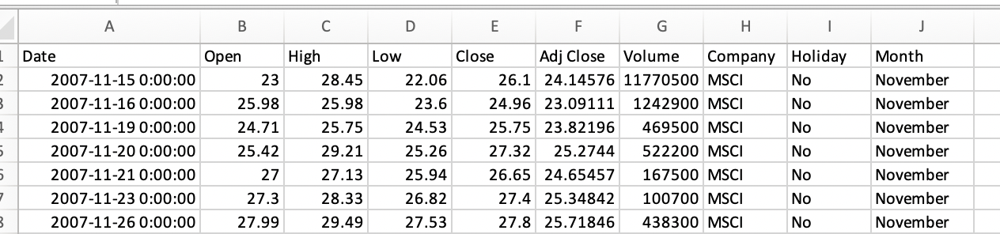

# Mini-project: gather data via different sources, e.g. API, webscraping based on research questions
### **Thinh Nguyen**
### _Cohort: DAPTAMS0321_
### _Amsterdam, March - 2021_

## Dataset Description

- The dataset is quite simple. It contains stock data of the following companies/indices:
    1. MSCI 
    2. S&P 500
    > Those two indices are the main interests
    3. Apple
    4. Microsoft
    5. Google
- It covers all the "max" stock data of each company/index, meaning from the start of the recording up till now.

- The dataset also contains a column indicating if a date is a federal holiday of the US.
- The dataset exists both in excel format and in a pandas dataframe
- The structure of the data can be seen, as follows:

